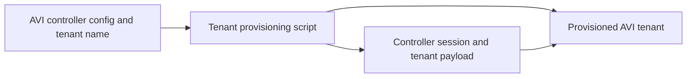
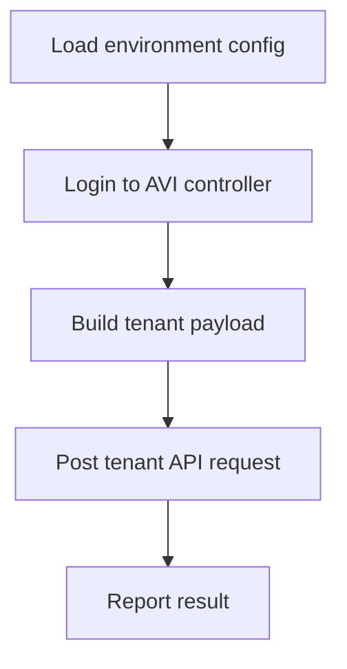

# VMware AVI Tenant Provisioning Architecture

## Purpose

Focused script for environment-driven VMware AVI tenant creation.

## Stack

Python, Requests, VMware AVI Controller API

## System Context

## Runtime Workflow

## Production Readiness Notes

- Keep secrets in environment variables and commit only .env.example templates.
- Keep generated files, dependency folders, caches, and local databases out of version control.
- Run the GitHub Actions workflow before presenting or deploying changes.
- Update this document when the source layout, dependencies, or deployment model changes.

## Review Checklist

- Architecture diagram matches current source files.
- Workflow diagram matches the main user or data path.
- README links to this architecture document.
- CI workflow validates the project on every push and pull request.

